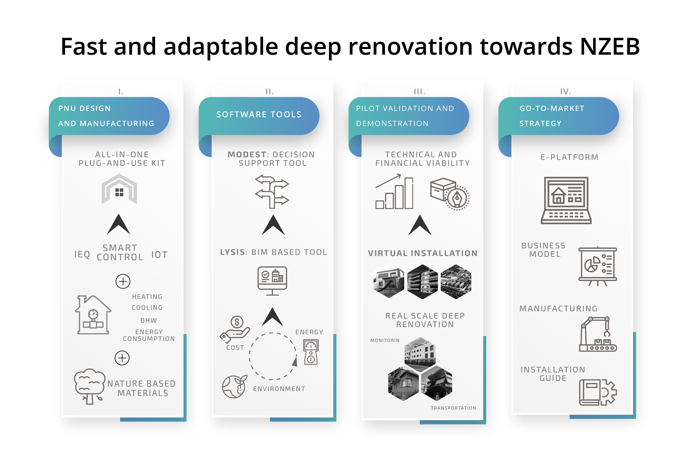

# Plug-and-use renovation with adaptable lightweight systems

The European Research & Innovation project PLURAL funded by the Horizon 2020 programme aims to design, validate and demonstrate a palette of versatile, adaptable, scalable, off-site prefabricated Plug-and-Use kits. The objectives of the project will be achieved through the international cooperation of 18 partners from 7 European countries with an overall budget of 9,5 million EUR.

:arrow_right: Reduction of energy consumption, emissions and carbon footprint of buildings is vital in meeting the **EU's climate and energy targets for 2030**.

:arrow_right: The Near Zero Energy Building concept requires a **high level of energy efficiency**, in combination with **on-site renewable energy production and use**.

:arrow_right: It is evident that improving the energy performance of buildings calls for **retrofit/renovation** actions that not only meet the **energy and environmental targets**, but also ensure **minimum disturbance** of the inhabitants and indoor comfort.

:arrow_right: The PLURAL project aims to tackle this challenge by developing **“Plug-and-Use”** kits for fast and energy efficient deep retrofitting.

## Objectives 

<!-- The PLURAL project aims to design, validate and demonstrate a palette of versatile, adaptable, scalable, off-site prefabricated plug-and-play kits that account for user needs, thus named “Plug-and-Use” (P-n-U) kits”. -->

<b>NEAR ZERO ENERGY CONSUMPTION</b>

Heat losses through the envelope will be minimized through improved insulation of the façade components, (U values < 0.23 W/m2K; Building primary energy consumption < 60 kWh/m2).

<b>COST-EFFECTIVE</b>

Better descriptions result in more sales. About a 58% reduction in renovation costs will be achieved via offsite prefabrication, lean manufacturing and construction interactively supported by the BIM-based platform and Decision Support Tool.

<b>FAST RENOVATION</b>

At least a 50% reduction in the time required for deep renovation mainly by reducing the time to design, procurement, logistics, fabrication and site preparation from average 5-7 months to 2-4 months.

<b>ENVIRONMENTALLY-FRIENDLY</b>

The deep renovation aims at the reduction of CO₂ emissions to reach 15% less than the current average of 0.6 tCO₂eq/m2 and additionally to achieve 70% material recyclability.

<b>FLEXIBLE</b>

System combinations will allow easy adaptation of the PnU kits to be developed and validated as part of the project to various residential building typologies in all EU climatic zones.

## Pillars

